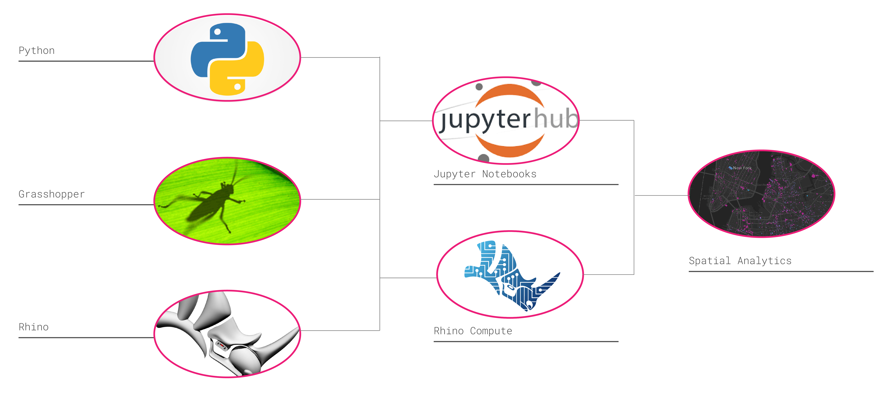
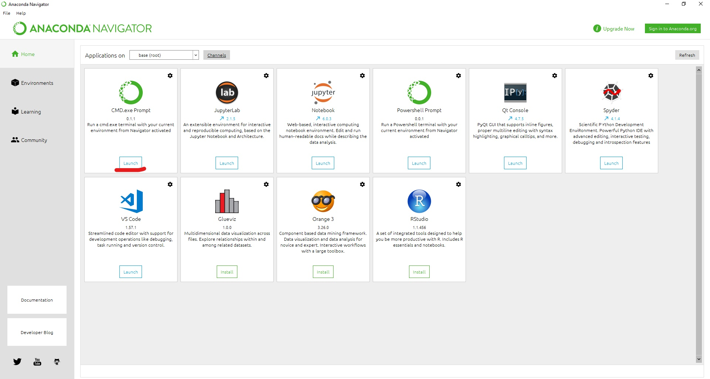
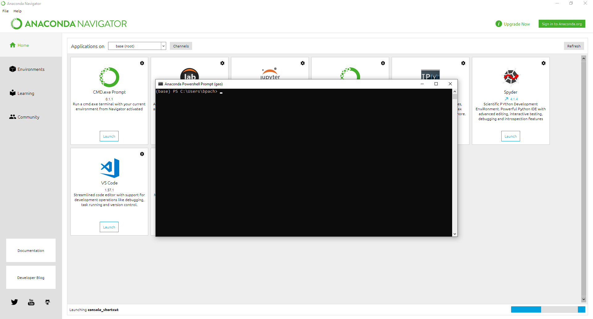
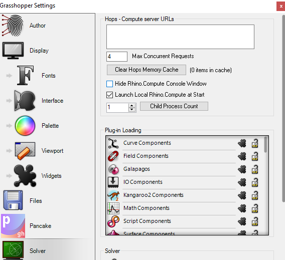
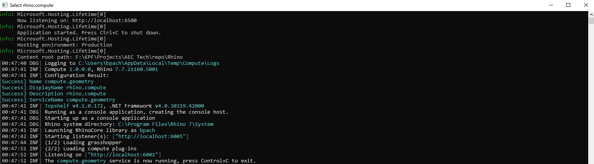

# Rhino Compute Workshop

## Introduction

This tutorial will walk you through connecting a Python Jupyter Notebook to Rhino Compute.

## Agenda

- Introduction
- Presentation
- Installation
- Jupyter notebook intro 
- Spatial analytics	
- Rhino Compute connection line by line code	
- Advanced section
- Q/A

## Installation

Install the following packages in order.

### Anaconda

[Installation Link](https://docs.anaconda.com/anaconda/install/windows/)

Anaconda is a distribution of the Python for scientific computing, that aims to simplify package management. The base installer comes with *Python 3.8*.

Once installed, open the `CMD.exe Prompt`

This will open a command prompt in the *conda* default *base* environment. From here you can install all packages.

### Jupyter-Lab

If Jupyter Lab is not shown in the *Anaconda Navigator* install using the following.

[Jupyter Lab Homepage](https://jupyter.org/install)

`pip install jupyterlab`

Once, installed, launch JupyterLab in Powershell/Terminal. It will open a browser window in the default directory.

### Rhino3dm

[Rhino3dm Homepage](https://pypi.org/project/rhino3dm/)

CPython package based on OpenNURBS with a RhinoCommon style.

`pip install rhino3dm`

### Matplotlib

[Matplotlib Homepage](https://matplotlib.org/) is a library for creating visualizations in Python. The possibilities are almost endless with what you can create from static, animated, and even interactive visualizations all with very few lines of code.

`pip install matplotlib`

### Geopandas

[Geopandas](https://geopandas.org/getting_started/install.html)

GeoPandas is an open source project to make working with geospatial data in python easier. GeoPandas extends the datatypes used by pandas to allow spatial operations on geometric types. Geometric operations are performed by shapely. Geopandas further depends on fiona for file access and matplotlib for plotting.

`conda install geopandas`

### SkLearn

`Scikit-learn` is an open source machine learning library that supports supervised and unsupervised learning. It also provides various tools for model fitting, data preprocessing, model selection and evaluation, and many other utilities. We will be using [Kmeans](https://scikit-learn.org/stable/modules/generated/sklearn.cluster.KMeans.html) clustering to cluster simliar tax lots together and color them.

[Installation link](https://scikit-learn.org/stable/getting_started.html)

`pip install scikit-learn`

### Ladybug

Ladybug allows you to import and analyze standard weather data in Grasshopper; draw diagrams like Sun-path, wind-rose, radiation-rose, etc; customize the diagrams in several ways; run radiation analysis, shadow studies, and view analysis.

[Installation Link](https://www.food4rhino.com/en/app/ladybug-tools)

### Grasshopper + HOPS

[Hops Website Link](https://developer.rhino3d.com/guides/grasshopper/hops-component/)

1. Open Rhino 7
2. type `PackageManger` in the Rhino command line.
3. search for *Hops*
4. Select *Hops* and install
5. Restart Rhino

Open Grasshopper and go to *Preferences* --> *Solver* and uncheck *Hide Rhino Compute Window*. This will open the *Rhino Compute* window during development.

**Grasshopper Setting**

**Rhino Compute Terminal Window**

**Debug Environmental Variable**

To see debug messages during development in the *Rhino Compute* terminal window (Windows) go to *Edit System Environment Variables* --> *System Variables* and create a *New* variable *RHINO_COMPUTE_DEBUG* and set to `true`
